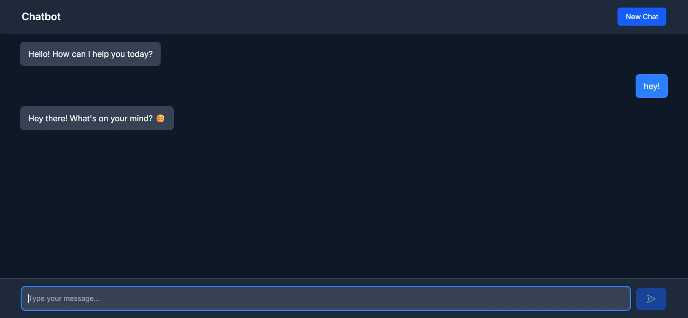

# Chatbot Portfolio Project

## Overview

This project is a full-stack chatbot application developed as a portfolio piece showcasing my web development skills. The application features a conversational interface built with modern technologies, enabling real-time streaming of responses.

## Features

- Real-time chat with streaming responses
- Syntax highlighting for code blocks
- Responsive design with dark mode support
- Clean and intuitive user interface

## Technology Used

- React and Next.js
- Tailwind CSS for styling
- OpenAI API (via Gemini API key) for chatbot responses
- Highlight.js for syntax highlighting

## Screenshots

<!-- Place the screenshot image in the screenshots folder -->

## Live Demo

Check out the [live demo](https://chatbot-ochre-seven.vercel.app/)
