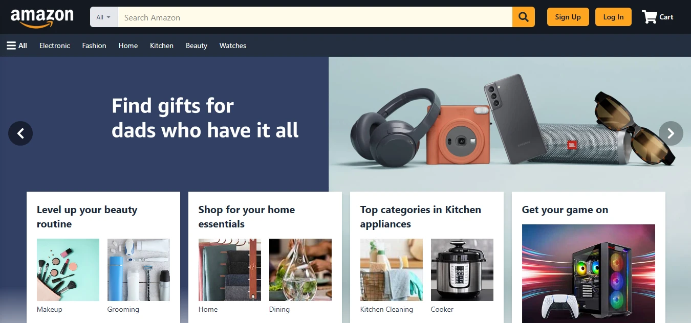
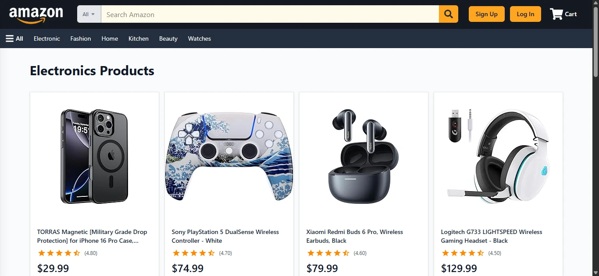
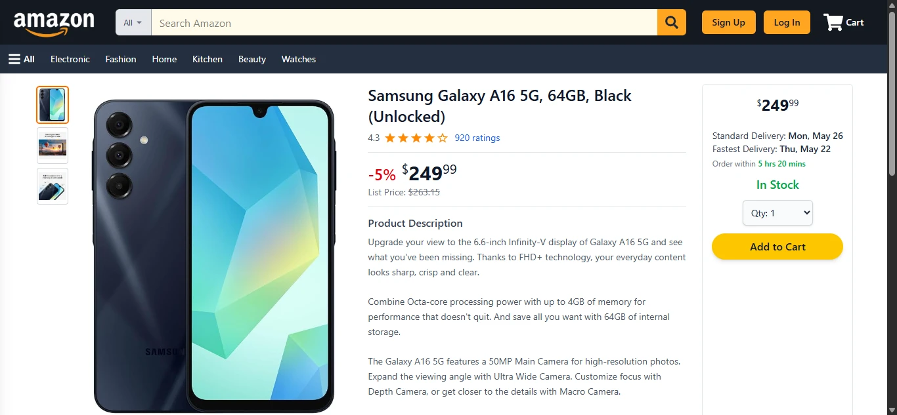
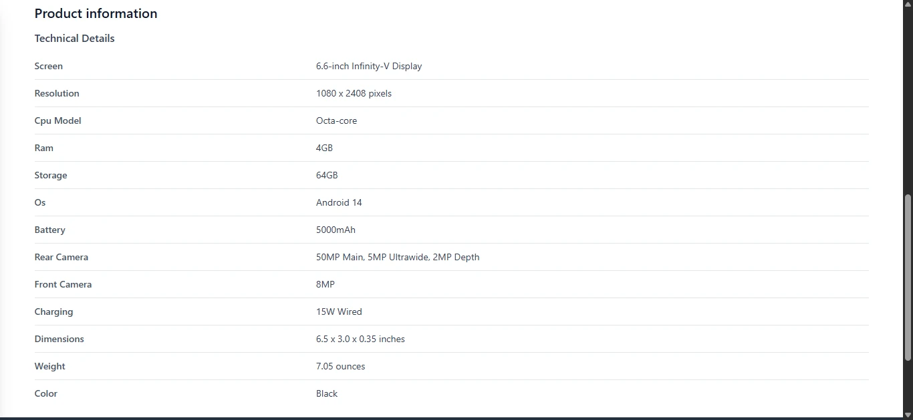
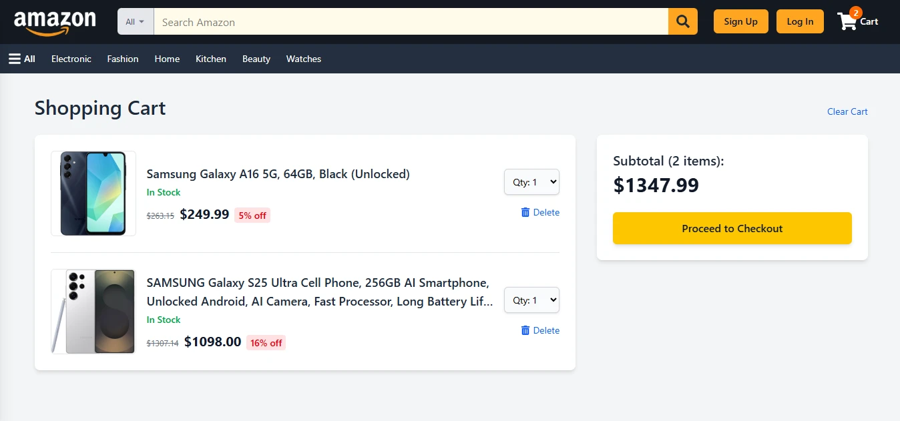
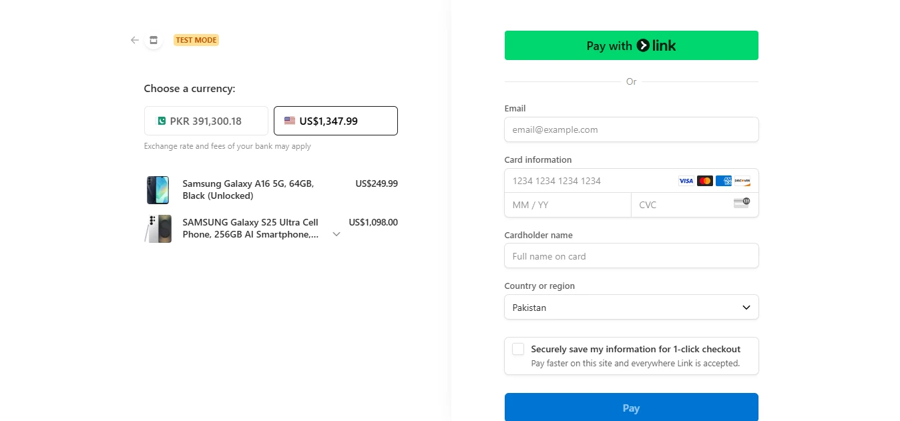
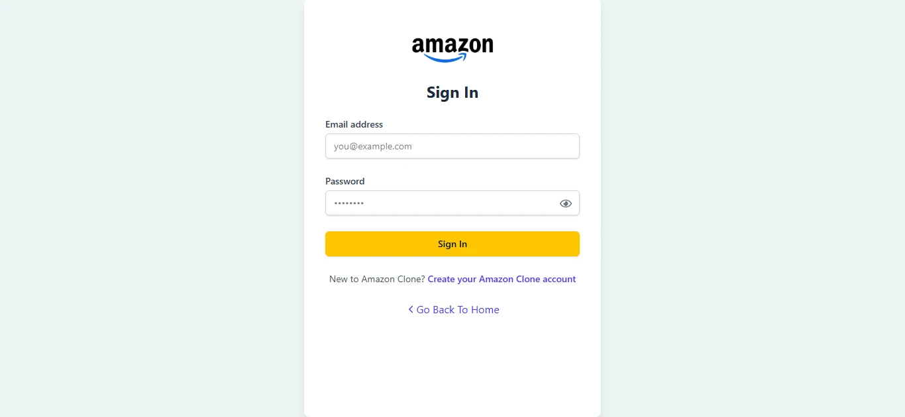
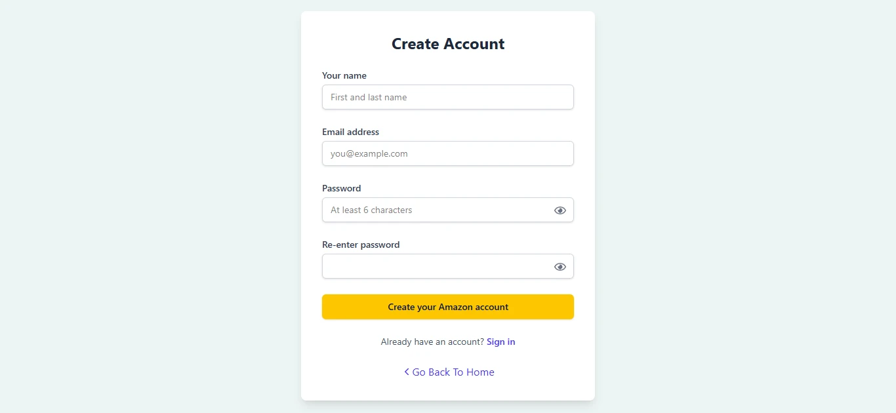

# E-Commerce app (Amazon-Clone Project)

## Description

The Amazon-clone project is a streamlined web application replicating the fundamental features of Amazon. Users can easily browse products, add them to a cart 🛒, and seamlessly proceed to checkout. This project serves as a hands-on learning experience for me 💻, allowing me to enhance my skills in both front-end and back-end development. By integrating payment gateways, I gained valuable insights into the complexities of building a comprehensive e-commerce site 🌐.

## Features

Main features of Amazon-Clone:

- User authentication and authorization
- Shopping cart and checkout functionality
- Product search and filtering
- Payment integration with Stripe and more

## Technologies (MERN Stack)

This project is built using the MERN stack, with some of the technologies and tools listed below:

- React
- Tailwind CSS
- React Router
- Node
- MongoDB
- Express
- Stripe
- Json Web Tokens

## Screenshots

  

    
    
Home Page

  

  

    
    
Products Page

  

  

    
    
Product Detail Page

  

  

    
    
Product Information

  

  

    
    
Shopping Cart

  

  

    
    
Stripe Checkout

  

  

    
    
Login Page

  

  

    
    
Register Page

  

